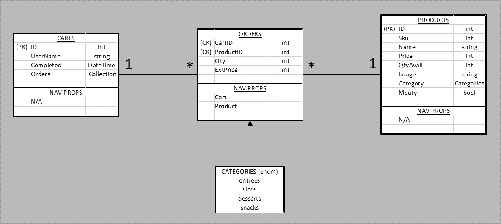

## *** NO LONGER DEPLOYED ON AZURE ***  

# ReFresh Foods 
ReFresh Foods is an ASP.NET Core (MVC) eCommerce website offering leftovers for sale. Registered users can log in (using local or 3rd-party authentication) to see customized content and to shop. Guest users can browse the page at their leisure, or they can register for an account for customized content and shopping.

## Getting Started, Build, and Test
To build and run this page locally (using Visual Studio and SQL Server):
1. Clone the repo locally and compile it. There are no additional external dependencies or data sources to load/access.
2. This application uses User Secrets. You will need to register the application with Microsoft, Facebook, and SendGrid, and choose a location for 2 databases (one for products, one for users).
    - Copy this into your secrets.json and replace secrets where indicated:  
    {  
      "ConnectionStrings": {  
        // PRODUCTS DB (SQL)  
        // If you choose to use a local products DB:  
        "ProductionConnection": "Server=(localdb)\\MSSQLLocalDB;Database=ReFreshFoodsDB;Trusted_Connection=True;MultipleActiveResultSets=true",  
        // Alternately, if you choose to set up a remote products DB:
        "ProductionConnection": "<enter your remote products DB connection string here>",  

        // USER DB (SQL) - This uses Microsoft.AspNetCore.Identity API.  
        // If you choose to use a local User DB:  
        "UserConnection: "Server=(localdb)\\MSSQLLocalDB;Database=UserDB;Trusted_Connection=True;MultipleActiveResultSets=true", 
        // Alternately, if you choose to set up a remote User DB:  
        "UserConnection": "<enter your remote User DB (MS Identity) connection string here>",  

        // Register the application with Microsoft OAuth at: https://apps.dev.microsoft.com  
        // Setup instructions at: https://docs.microsoft.com/en-us/aspnet/core/security/authentication/social/microsoft-logins?view=aspnetcore-2.2  
        "Authentication:Microsoft:ApplicationId": "<enter your Microsoft OAuth application ID here>",  
        "Authentication:Microsoft:Password": "<enter your Microsoft OAuth application password here>",  

        // Register the application with Facebook OAuth at:  
        // Setup instructions at:  
        "Authentication:Facebook:ApplicationId": "<enter your Facebook OAuth application ID here>",  
        "Authentication:Facebook:Password": "enter your Facebook OAuth application password here>",  

        // EMAIL NOTIFICATIONS  
        // Register the application with SendGrid and get an API key at https://signup.sendgrid.com/?id=71713987-9f01-4dea-b3d4-8d0bcd9d53ed  
        "SendGridAPIKey": "<enter your SendGrid API key here>"  
      }  
    }  

3. Build the product database using existing migration (Update-Database -Context ReFreshDbContext).
4. Build the users database using existing migration (Update-Database -Context UserDbContext).
The application is ready to run via your local/live server.  

Unit testing is built with xUnit. Tests address get/set for all model properties and all methods in InventoryManagementService. Once the solution is built locally, select 'Run All' in Test Explorer to run tests.

## Architecture
This application is built on ASP.NET Core using Model-View-Controller (MVC) architecture. It uses Entity Framework Core's object relational mapping (ORM) to leverage the application's classes as data model definition, and to seamlessly move between the data storage and manipulation.  It relies on 2 SQL databases - one to manage products, and a separate one to manage user accounts (data security requires separation of these concerns).  It is enabled for 3rd-party authentication (OAuth) via Microsoft and Facebook.  Notification emails are automatically generated on registration and ordering using SendGrid.

Site policy grants anonymous access to Home, Login, Registration, Products, and Product Details. Access to products marked 'meaty' is restricted for users self-identified as non-meat-eaters (they are redirected to a route that returns only products marked 'meaty = false'). Access to cart/checkout/receipt pages is restricted to logged-in users.

### User Database
The User data model contains only basic properties (name and birthdate); however, the Identity API (Microsoft.AspNetCore.Identity) adds properties required in order to support security requirements. A View Model allows the application to capture data to populate the other Identity-initiated properties (ie - password) without having those appear in the User class. On registration, the user is also asked to state whether (s)he eats meat - a 'Carnivore' claim is captured to support product access restrictions (ie - to avoid displaying potentially offensive products to these customers). A 'FullName' claim is also captured, but it is built from First Name and Last Name inputs instead of requested separately. The 'FullName' claim supports display personalization (such as custom greetings).  

3rd-party authentication is enabled for users with a Microsoft or Facebook account. When a new user selects and accomplishes a 3rd-party login, (s)he is prompted to register for a new local account - the new account created in such a manner will be associated with that 3rd-party login going forward, so future login attempts via 3rd party will authenticate locally. Existing accounts cannot be retroactively associated with a 3rd-party login - the user will be prompted to create a new account.

### Product Database
The Inventory data model contains properties to describe the product, pricing, meal category (enum), display data (such as image path string) and whether it contains meat. The Products page allows user-initiated filtering by category or by keyword search; the 'Carnivore' user claim enables policy-based filtering (filtered on the 'Meaty' property) - this filtering is transparent to the user.  The Inventory table is pre-seeded with 10 products.

The Cart data model associates a grouping of 'Orders' (see below) with a user.  Because the User DB is necessarily isolated from the Products DB (for account security), the user's email becomes the only point of association - the User DB is not leveraged for shopping except to provide the email address to associate with a cart.  A cart is issued to a user at login (one is created if there isn't already an open one available). The user 'adds items' to the cart (ie - creates an association between a cart by ID and a product by ID, with Extended Price (ExtPrice) and Qty set on add... this is called an 'Order'). When the user selects 'Check Out', the cart's 'Completed' property is updated with a timestamp, and a receipt is generated to display and to be sent via email, and a new cart is generated for future shopping.

The Order data model is a join between an entry in the Inventory (ie - Products) table and an entry in the Carts table; that is, it 'puts' a Product into a Cart. It also carries Qty and ExtPrice as payload. Each entry is identified by a composite of the cart's primary key and the product's primary key. Since a 'check out' action closes the cart and disallows future changes, the cart ID serves as the order ID for future reference - all items associated with a CartID become a completed purchase.  

  

Dependency injection is used to isolate the data storage from its point of use (ie - the CRUD logic in the page routes). The Identity API includes interfaces and services for the user - those services have been injected into pages where user data is needed to change the displayed content (such as displaying a login link if no user is logged in). Additionally, the app contains an interface package for products to avoid direct coupling between page route logic and the Products database. Interfaces and associated services are built for Cart (to manage Cart and Orders CRUD, checkout steps, receipts and notifications), Inventory (to manage Inventory CRUD).

## Credit
This project is a collaborative effort by:  
  Sean Miller - https://github.com/deliman206  
  Gwen Zubatch - https://github.com/GwennyB  
  
Third-party HTML/CSS content from (TBD).
